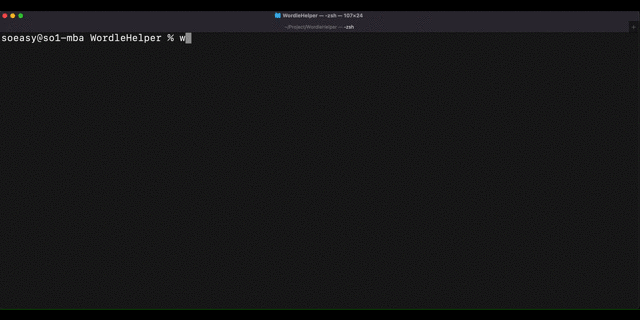

# **WordleHelper**

Command line tool to help solving the wordle by narrowing down the filtered words. 



# Requirement

- python3

# Usage

```bash
git clone https://github.com/so1earth/WordleHelper.git
cd WordleHelper
python3 wordlehelper.py

```
Note: gif demo above is using alias for easy access.

# License

"WordleHelper" is under [MIT license](https://en.wikipedia.org/wiki/MIT_License).
